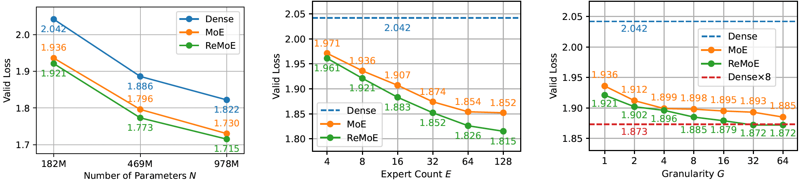
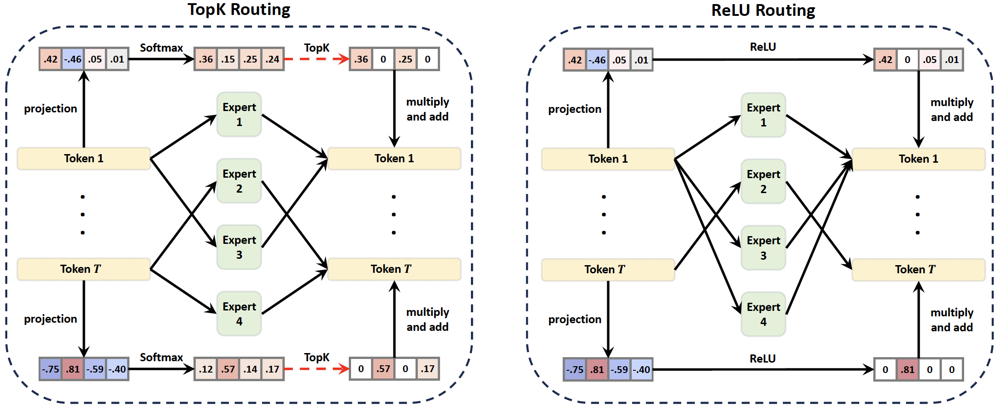

<div align="center">

ReMoE
===========================
<h4>Codebase for the paper "ReMoE: Fully Differentiable Mixture-of-Experts with ReLU Routing"</h4>



ReLU-routed ReMoE consistently outperforms TopK-routed MoE

<div align="left">

### Overview:
ReMoE is a fully differentiable mixture-of-experts(MoE) architecture with ReLU routing and adaptive L1 regularization to control the sparsity.
This repository builds upon [Megatron-LM](https://github.com/NVIDIA/Megatron-LM/) and provides the implementation with minimal changes to the original codebase.


Comparing to the conventional TopK-routed MoE, ReMoE has the following advantages:

1. **Fully differentiable:** ReMoE is continuous and fully differentiable, which allows optimizing with the correct gradients.
2. **Dynamic expert allocation:** ReMoE allocates different numbers of experts to tokens based on the token's importance, which is determined by the ReLU activation.
3. **Consistent better performance:** ReMoE consistently outperforms the TopK-routed MoE across various model sizes, expert counts, and granularities.
4. **Plug-and-play:** ReMoE can be easily integrated into existing MoE-based models with minimal changes to the routing logic (TopK+Softmax -> ReLU), without altering the compute flow.


<div align="center">
Comparison of ReLU-routed ReMoE with TopK-routed MoE
<div align="left">


### Installation:
ReMoE shares the same dependencies as Megatron-LM. You can use the [NGC's Pytorch container](https://catalog.ngc.nvidia.com/orgs/nvidia/containers/pytorch) recommended by Megatron. Alternatively, follow the manual installation steps below:
```bash
conda create -n remoe python=3.11
conda activate remoe
# install torch and numpy
pip install torch torchvision torchaudio numpy

# install flash-attention
pip install packaging ninja
pip install flash-attn --no-build-isolation

# install apex
git clone https://github.com/NVIDIA/apex
cd apex
pip install -v --disable-pip-version-check --no-cache-dir --no-build-isolation --config-settings "--build-option=--cpp_ext" --config-settings "--build-option=--cuda_ext" ./

# install TransformerEngine
pip install git+https://github.com/NVIDIA/TransformerEngine.git@stable
```

### Usage:
To enable ReLU routing in the MoE layer, set `--moe-relu-routing` when configuring the model. Experiment launch scripts for reproducing the results from the paper are available in the [scripts](scripts) directory. You can modify these scripts for your own configurations and datasets in Megatron-LM's format.

For research study, you can refer to [megatron/core/transformer/moe/router.py](megatron/core/transformer/moe/router.py) for the implementation of ReLU routing and [megatron/training/training.py](megatron/training/training.py) for the adaptive L1 regularization.

### Reproducing the results:

Below is a guide to reproduce the results in the paper from scratch.
1. **Data preprocessing:**
Download the Pile dataset from [Hugging Face](https://huggingface.co/datasets/monology/pile-uncopyrighted). Preprocess it with:
    ```bash
    bash data_perprocessing.sh
    ```
    Some minor modifications are required, such as the path to vocabulary files.

2. **Training:**
Run the following script for pretraining ReMoE models:
    ```bash
    # Full command:
    # bash scripts/train_llama_182m_remoe.sh [gpus_per_node] [train_iters] [micro_batch_size] [num_experts] [granularity] [project_name]
    bash scripts/train_llama_182m_remoe.sh
    ```
    MoE and dense models can be trained in similar ways. Please refer to the [scripts](scripts) directory for more details.